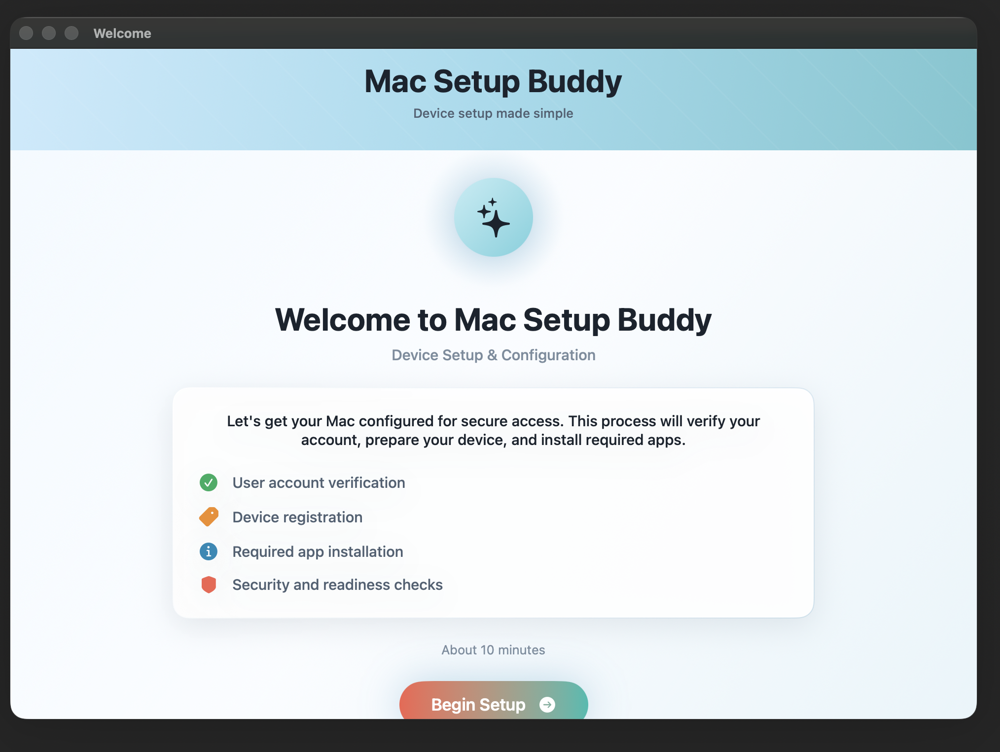

# Mac Setup Buddy

Mac Setup Buddy is a macOS setup assistant for guided device onboarding. It gives users a clean setup flow for welcome messaging, user authentication, network readiness, software deployment, error recovery, and final device summary screens.

The app is built with SwiftUI and supports automatic Light Mode and Dark Mode styling based on the Mac's current appearance.



## Highlights

- Guided onboarding flow for macOS setup
- Welcome, authentication, deployment, recovery, and completion views
- Adaptive Light Mode and Dark Mode theme
- Built-in Light Mode and Dark Mode default banner artwork
- Configurable text, app names, install items, support details, and branding
- Runtime Preview Mode for reviewing screens without running setup actions
- JSON configuration with a published schema and sample file
- Support report export from recovery and completion screens
- Config validation and Network Required gate for safer deployments
- Software deployment progress view with status cards and activity stream
- Recovery screen for retry, skip, or support handoff
- Cleaned public project naming and package script

## Screen Views

| Screen | Purpose |
| --- | --- |
| Welcome | Introduces the setup process and expected steps. |
| User Authentication | Collects the user's work email before continuing setup. |
| Software Deployment | Shows installation progress, status, and activity logs. |
| Error Recovery | Gives clear actions when an install stalls or fails. |
| Setup Complete | Summarizes user profile and device readiness. |

See [docs/SCREEN_VIEWS.md](docs/SCREEN_VIEWS.md) for the full screen gallery.

## Wiki

Project wiki pages are included in the [wiki](wiki) folder so they can be pushed to the GitHub Wiki or read directly in the repository:

- [Home](wiki/Home.md)
- [Screen Views](wiki/Screen-Views.md)
- [Configuration](wiki/Configuration.md)
- [Build and Packaging](wiki/Build-and-Packaging.md)
- [Troubleshooting](wiki/Troubleshooting.md)

## Build

Open `Mac Setup Buddy.xcodeproj` in Xcode, then build the `Mac Setup Buddy` scheme.

Command line:

```bash
xcodebuild \
  -project "Mac Setup Buddy.xcodeproj" \
  -scheme "Mac Setup Buddy" \
  -configuration Debug \
  build
```

## Preview Mode

Preview Mode opens a screen gallery for Welcome, Authentication, Deployment, Recovery, and Completion. It uses the same UI components, banner logic, and Light/Dark Mode appearance as the production screens, but it does not run installs or policies.

```bash
open "build/DerivedData/Build/Products/Debug/Mac Setup Buddy.app" --args --preview
```

You can also launch Preview Mode from JSON:

```bash
open "build/DerivedData/Build/Products/Debug/Mac Setup Buddy.app" --args --config config/sample-config.json
```

## JSON Configuration

The schema and sample config live in:

- [config/mac-setup-buddy.schema.json](config/mac-setup-buddy.schema.json)
- [config/sample-config.json](config/sample-config.json)

Use `branding.bannerImagePath` to set a custom banner. Leave it out to use the built-in adaptive Light/Dark banner.

Validate a JSON config before deploying it:

```bash
"build/DerivedData/Build/Products/Debug/Mac Setup Buddy.app/Contents/MacOS/Mac Setup Buddy" \
  --validate-config config/sample-config.json
```

Enable the Network Required gate from JSON:

```json
{
  "ui": {
    "requireNetwork": true,
    "networkCheckHosts": ["https://apple.com"]
  }
}
```

Or from the command line:

```bash
open "build/DerivedData/Build/Products/Debug/Mac Setup Buddy.app" --args \
  --require-network \
  --network-hosts https://apple.com \
  --screen welcome
```

## Support Reports

The Error Recovery and Setup Complete screens can export a JSON support report to the Desktop. Reports include the timestamp, computer name, user/device details when available, FileVault state, failed policy details, and diagnostics.

## Package

The package script builds the app and creates an unsigned installer under `dist/`.

```bash
./build_package.sh
```

## Notes

- Review setup workflows before production use, especially local account creation, policy execution, credential handling, and support contact behavior.
- Keep organization-specific domains, logos, policies, and support contacts in configuration rather than hard-coding them into the app.
- Set `bannerImage` in configuration to use your own banner instead of the built-in default artwork.
- Build output under `build/` and package output under `dist/` should stay out of source control.
