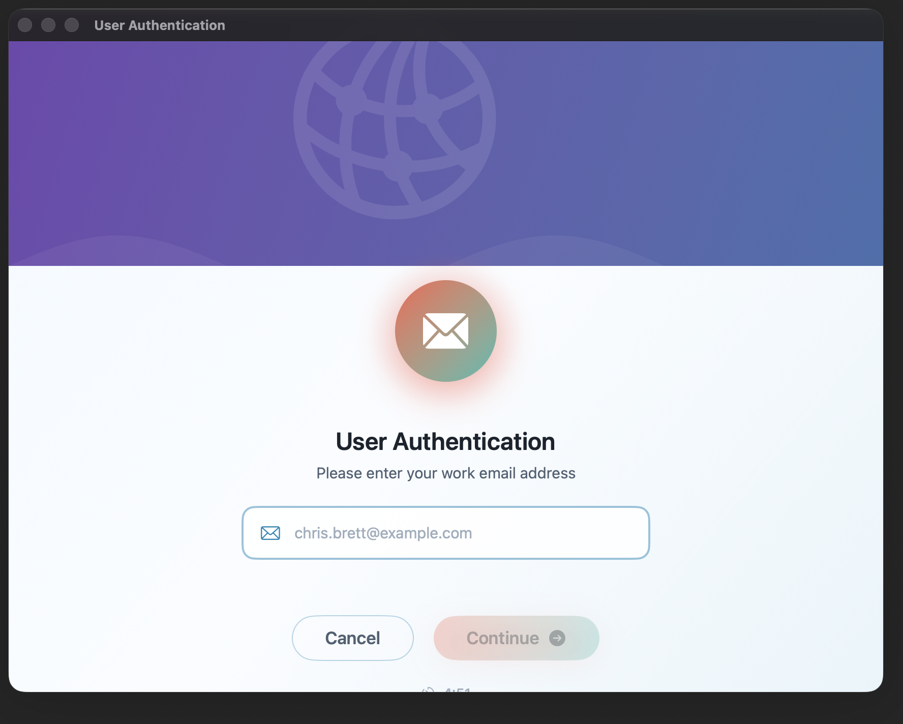
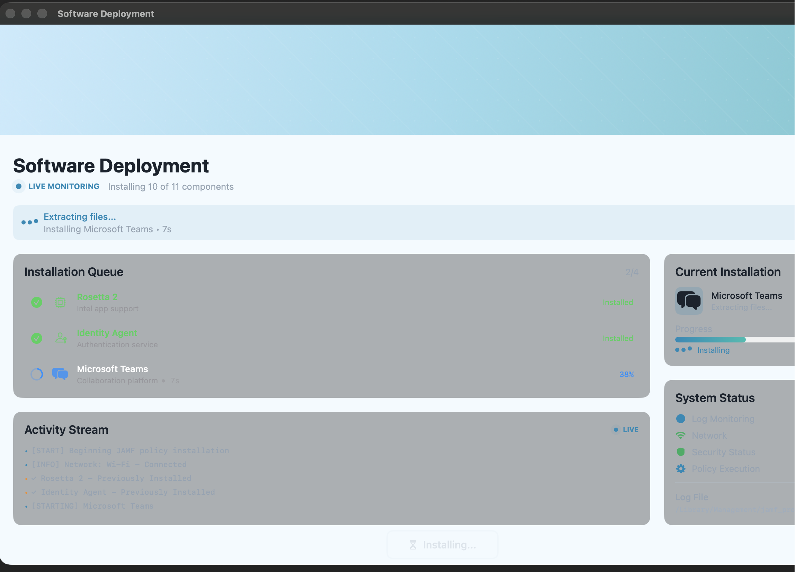
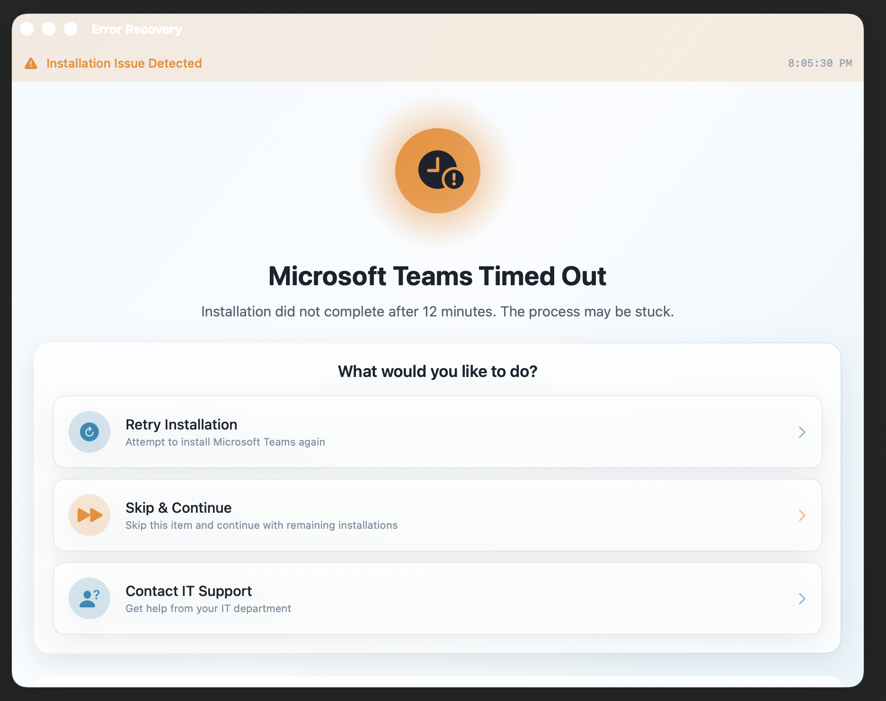
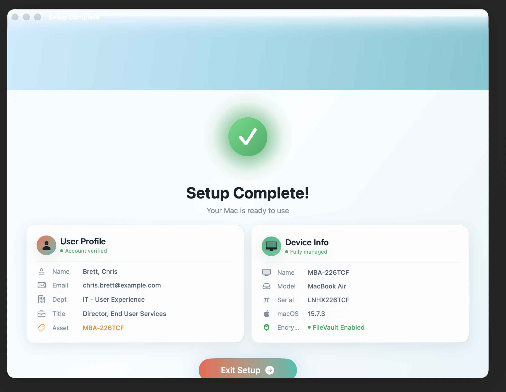

# Screen Views

Mac Setup Buddy is organized around the user-facing setup journey.

## Welcome

Introduces the setup process and gives the user one clear action to begin.

## User Authentication

Collects the user's work email address before continuing with setup and identity checks.

## Software Deployment

Shows installation progress, the current app or policy being installed, system status, and activity logs.

## Error Recovery

Gives clear options when an installation stalls or fails: retry, skip, or contact support.

## Setup Complete

Confirms the Mac is ready and displays the final user and device summary.

